# Camera Trap Sorting and Scoring Protocol

University of Arizona

Updated September 16, 2022

## Purpose

This goal of this document is to explicitly detail the methods used in the sorting and scoring of camera trap photos used in the study of wild horse/elk/cattle interactions. See definitions for *sorting* and *scoring*. Additionally, this document aims to increase repeatability and reduce subjectivity when scoring camera trap photos. *Repeatability* ensures that different people can use this methodology to produce the same results for each photo. Scoring camera trap photos inherently involves some subjectivity i.e., personal judgement when scoring dark, blurry, or obscured photos. By following the best practices outlined below, researchers scoring camera trap photos can reduce subjectivity to a minimum.

### Important Definitions

**Photo Sorting**: the process by which researchers look through the file folders of camera trap photos and copy the photos with subjects (e.g., horses, elk, cattle, humans, deer etc) into new file folders. The goal of sorting is to reduce the amount of time spent *scoring* photos without subjects (i.e. empty photos). Note: photos without subjects are still important data and should *not* be deleted from the photo database.

**Photo Scoring**: the process by which researchers examine camera trap photos and translate the things they see in the photo to data in a format (e.g., Excel spreadsheet) that can later be used for analysis. The goal of scoring is to generate *useful* data that can be analyzed through statistical means. Note: Emphasis is placed on useful data, as researchers must pre-define a set of criteria to be extracted from camera trap photos (e.g., species, number of individuals, group size, behaviors) based on *a priori* hypotheses or predicted patterns. Extraneous (*not useful*) data is often collected which slows down photo scoring and can be a time-sink. Researchers must make a careful consideration of what criteria to score before photo scoring occurs (and ideally at the beginning of the study).

**Subject**: species or thing of interest (as defined by the photo scoring criteria) that are visible in the photo, including: horse, cow, elk, mule deer, turkey, pronghorn, coyote, wolf, grey fox, mountain lion, bobcat, bear, cottontail, jackrabbit, skunk, raccoon, human, dog, horseback, ATV, UTV, Truck/SUV, and other.

**Time-lapse Camera**: a camera trap that takes photos at a specified time interval: 1 photo/5min for sites in White Mountains, and 1 photo/5min for sites in Heber, Arizona and New Mexico. Time lapse cameras have motion-activated settings set to 1 motion-activated photo per hour (motion settings cannot be disabled outright).

**Trail Camera**: a camera trap that takes photos *only* when its passive infrared motion sensor is activated, typically by an animal walking by, but sometimes from grass blowing in the wind or other sources. Time delays between photos (sometimes called quiet periods) can be set in the camera's settings.

**SD card**: also known as SDHC (high capacity), removable storage chip that is inserted into camera trap and photos are stored on the SD card in the camera.

### While in the Field

1. Navigate to the desired camera trap location. Coordinates and maps for each of the cameras can be found in the Appendix. Remove the camera from the case by unlocking the Python cable lock using the small key labeled P182 or P399. Key P182 unlocks cameras in New Mexico, whereas key P399 unlocks cameras in Arizona. *Watch out for spiders and other stinging insects, especially Black Widows, that may have made their home inside the security case.*

2. Open the camera and slide the switch from the 'On' position to the 'Setup' position (see below image for a reference). If the camera is dead, the LCD screen will fail to display text. Sometimes there is a delay between switching the camera from the 'On' position to 'Setup' position up to 10 seconds in some cases. If the LCD screen fails to illuminate, replace the batteries with new AA lithium batteries (avoid alkaline).

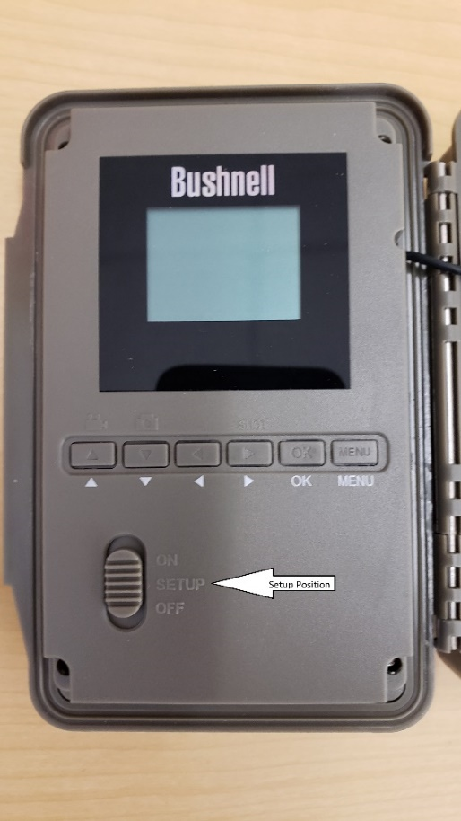

### Settings for Time-lapse Camera Traps

**Mode**: Camera
**Image Format**: Widescreen (Bushnell E3 N/A)
**Image Size**: HD Pixel
**Capture Number**: 1
**Interval**: 60 minutes
**Sensor Level**: Low
**Camera Mode**: 24 hrs
**Timestamp**: On
**LED Control**: High (Bushnell E3 N/A)
**NV Shutter**: Auto (Bushnell E3 N/A)
**Field Scan**: On
 **A**: 00:00 to 12:00
 **B**: 12:01 to 23:59
 **Interval**: 1 min for Boggy and Wildcat, 5 min for all other sites

### Settings for Motion Camera Traps

**Mode**: Camera
**Image Format**: Widescreen (Bushnell E3 models N/A)
**Image Size**: 3M
**Capture Number**: 1
**Interval**: 3 seconds
**Sensor Level**: Low
**Camera Mode**: 24 hrs
**Timestamp**: On
**LED Control**: High (Bushnell E3 models N/A)
**NV Shutter**: Auto or High (Bushnell E3 models N/A)
**Field Scan**: Off

>[!Note]
>Bushnell Essential E3 camera traps do not have some settings compared to the Bushnell Tropy or NatureView models. These settings have been marked as “(Bushnell E3 models N/A)“.

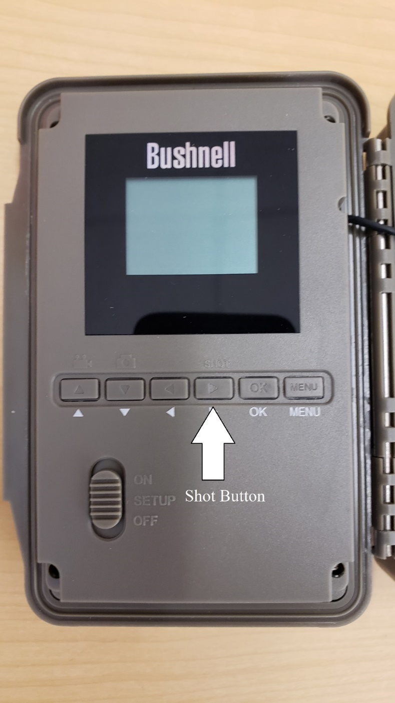

3. Fill out a Camera Trap Test Photo datasheet found in the Appendix with the date, time, lat/long, site code, and site name. Using the 'Shot' button on the camera trap, set the clipboard down on the ground and take a few photos of the Camera Trap Test Photo datasheet to embed a photo with the relevant metadata inside the photo folder on the SD card. This will help the photos be better documented for future use. See the below image for an example of camera trap that has taken a picture of the Camera Trap Test Photo datasheet.


4. Record the camera metadata using the Camera Trap Maintenance Visit datasheet found in the Appendix. This datasheet documents the number of photos and other relevant camera settings that are important. Pay special attention to the time and date difference between camera's clock and the actual time (from your watch or GPS). See the image below for an example of a completed Camera Trap Maintenance Visit datasheet.

>[!Note]
>Some of the fields have N/As because some Bushnell models have those settings and other models (e.g., Bushnell Essenstial E3) don't have those settings.*

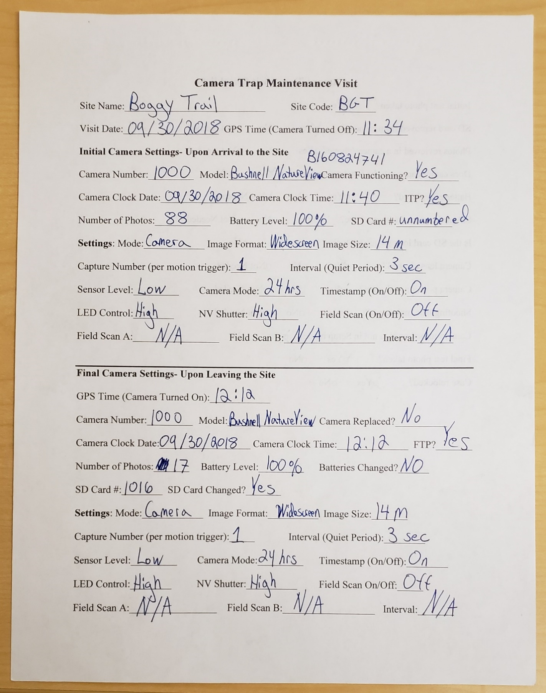

5. Remove the SD card from the camera and put it in the orange SD card case.

6. Put a blank SD card in the camera and new batteries, if required. Flip the Camera Trap Maintenance Visit datasheet over to the side labeled Camera Trap Visit Checklist. Use this checklist to ensure you don't make any mistakes and the camera is properly set to collect more photos, unless you are removing the camera from the field. See the below image for an example of a completed Camera Trap Visit Checklist.


## Data Management

### Downloading Camera Trap SD Cards Procedure

7. Insert the SD card into the SD card reader

8. Copy (do not Move or Cut/Paste) the "DCIM" folder from the SD card into a temporary folder on your desktop. This preserves the original folder on the SD card if you make a mistake.

9. Rename the "DCIM" folder that was copied to desktop by double clicking on the folder name, and then using the following scheme: three-letter site code, the date of the first photo captured, and the date of the last photo captured, e.g.
   
>WCS_07302019_09182019

10. Install the Bulk Rename Command Line tool <https://www.bulkrenameutility.co.uk/> to rename each photo by the time and date it was captured. 

>[!Note]
>You may need to download and install this Bulk Rename Command Line utility if you haven't already.

>The following command will rename photos by their date and will append a number if the date and time is the same as another file which is what the `/NODUP` flag does.
>
>Change the name of the folder in the script (`andre\temp` below) to the location of the folder that you copied to a temporary folder on your desktop.
>
>Copy and paste this edited line into Windows Powershell or Command Prompt and press enter. Your window should scroll by fast if the script was executed correctly. If there is an error in the script (e.g., incorrect folder name) the renaming script will not work and will not show any output in the window.

```PowerShell
C:\Program` Files\BRC64\BRC64.exe /DIR:"C:\Users\andre\temp" /NOFOLDERS /RECURSIVE /PATTERN:"*.JPG" /REMOVENAME /APPENDDATE:M:P::-:10:"%Y-%m-%d-%H-%M-%S" /NODUP /EXECUTE
```

This code is from [bulk-rename-commands.ps1](../../scripts/utilities/bulk-rename-commands.ps1)

#task check if the `00-rename-photo-directories.R` copies folders to hard drives #updateprotocol 

11. Run the `01-extract-image-paths.R` script on the renamed parent folder (e.g., WCS_07302019_09182019). This may take a few minutes depending on the number of photos in the parent folder.

12. Check that the R script has finished running and has created a new csv file in the parent folder and the the csv file matches the name of the parent folder (e.g., WCS_07302019_09182019.csv). This csv creates a table of all the photos in each folder, so we have an inventory of all photos.

13. Copy and paste the folder onto a 4 Tb external hard drive in the correct folder location.

14. Run `02-copy-and-upload-folders-to-Box.R` to copy the folders that need to sorted to Box. This script copies the data that needs to be uploaded to a folder on your local hard drive, and then you manually need to upload it to Box, typically Box Drive is the best option.

## Processing Data

### Sorting Photos

See the [Photo Tagging and Sorting Using IrFanView](Photo%20Tagging%20and%20Sorting%20Using%20IrFanView.md) protocol for more details. This section provides a brief overview of the process.

15. **Tag Photos with Subjects** Photos with subjects are temporarily *tagged* in IrFanView.

16. **Record Subjects Metadata** The file names of tagged photos are also *recorded* as a text file to keep track of which files have subjects.

17. **Repeat this process for all of subfolders** (e.g., 100EK113) within a collection folder (e.g. WCN_04252018_05122018).

#task incorporate step `03-match-subject-photos-and-copy-to-subjects-subfolder.R` #updateprotocol 

### Scoring Photos

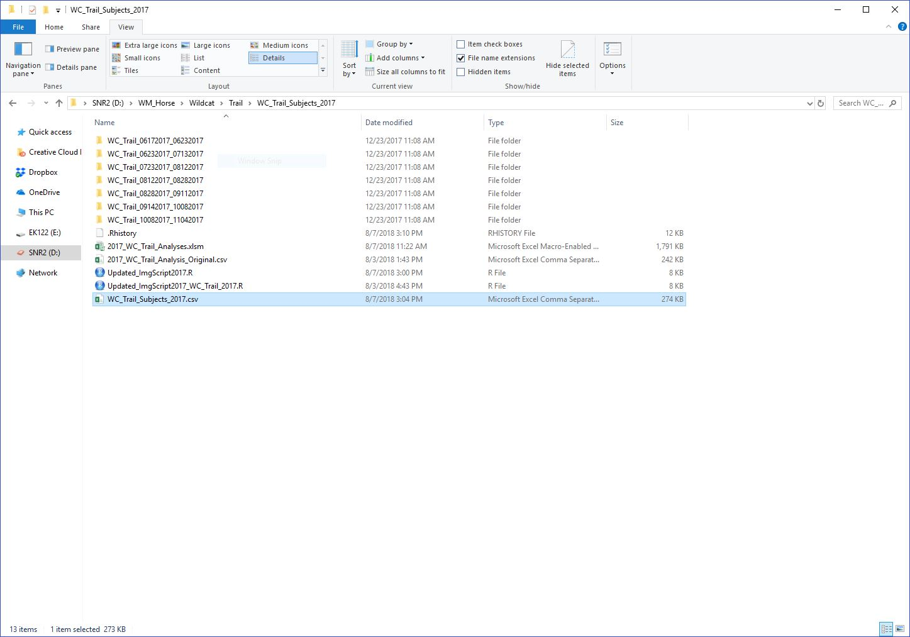

18. Open the .xlsm file in Microsoft Excel. You should see a spreadsheet with 8 columns. The number of rows will be however many photos were in the "subjects" folder you extracted the metadata from<sup>1</sup>. See screenshot below. 

>[!Note]
><sup>1</sup>Some photos may have been removed from the .csv file because they had file sizes of 0.

>[!Important]
>You must enable macros for this spreadsheet to work properly. See screenshot below.

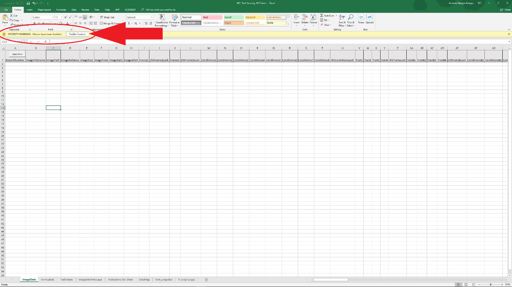

19. Navigate to the "ImageData" sheet on the lower left corner of the spreadsheet (See screenshot below).


20. You should get a .xlsm file that looks like this (see screenshot below).


21. Click on the button “Open Form” to launch the Scoring Macro (a graphical interface written in Visual Basic for Applications (VBA)) (See screenshot below).


#### Resizing the Macro Window to Fit Your Screen

#task include the option to dynamically resize the macro #updatemacro 

22. You most likely will need to change your computer's display settings to be able to see the entire window that pops up when you clicked "Open Form". This is a problem related to the macro itself, and the solution presented here is a represents a temporary fix.


As you can see, the macro is partially cut-off and doesn't fit on the screen.

23. To fix this, go to your desktop and right click on a blank space on your desktop. A menu (screenshot below) will open. Click on the option that says "Display settings".


The "Display" settings window will open. Scroll down until you see the "Scale and layout" option (screenshot below).

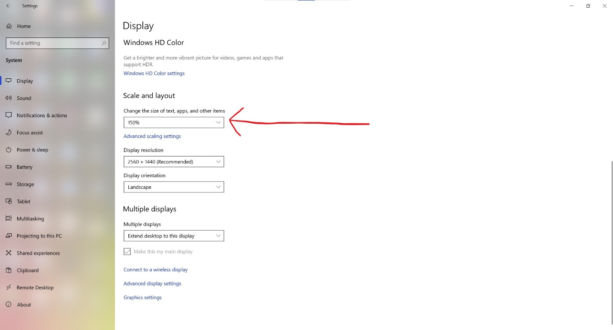

Under the "Change the size of text, apps, and other items" choose a smaller scaling percentage that fits the window that pops up from the Excel form. On my computer, 125% scaling makes the pop-up window fit my screen. You may need to choose 100% scaling depending on your screen's resolution.

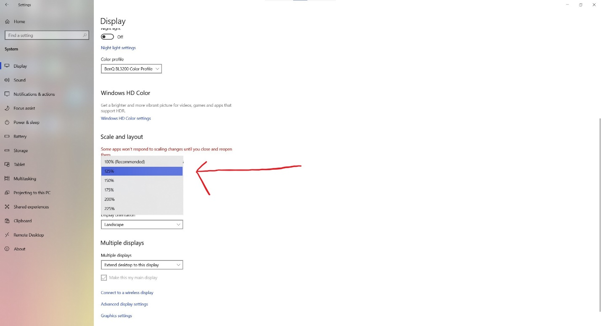

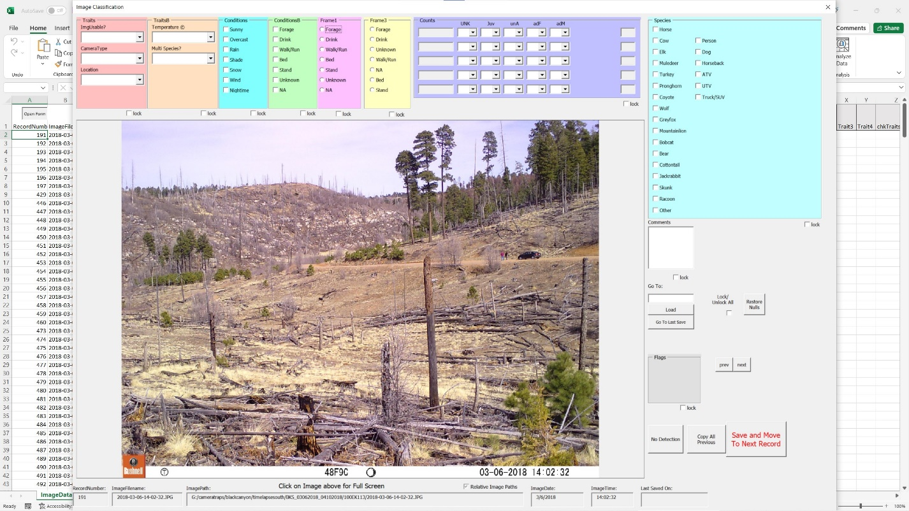

By changing the display scaling, the window now fits on my screen (barely). I had to hide the task bar so I could see the information displayed along the bottom of the macro window (see screenshot below).

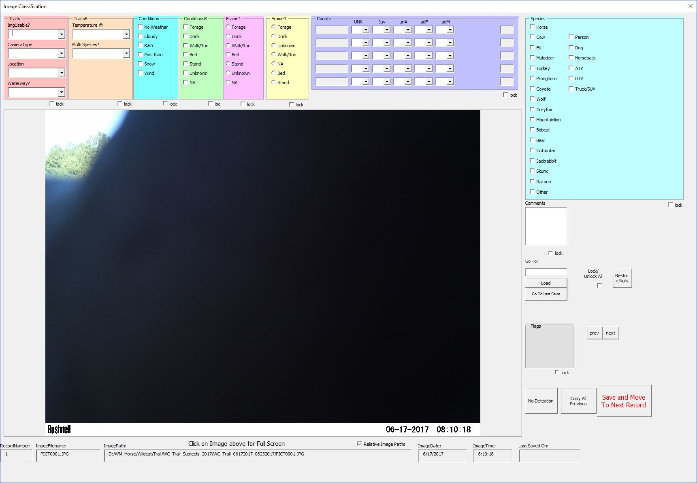

#### Entering Data in the Macro

24. The Photo Scoring Form runs on the Excel macro that was programmed into this spreadsheet using Visual Basic for Applications (VBA). The macro auto-fills in the spreadsheet rows with attributes that you select in the colored boxes. This allows researchers to collect a multitude of variables in a spreadsheet form that is easily analyzed statistically.

25. Certain sites have less than optimal camera angles, and as a result, some of the areas in each photo are what we consider too far away from the camera for human observers to make reliable estimates of species and number of individuals. We use references photos to identify these areas, and the reference photo for each site describes which areas within the photo to score, and what areas shouldn’t be scored. 

#task update reference photos and include links #updateprotocol 

26. The Photo Scoring Form does not store the photos inside the form, rather it uses file paths to find each photo and load the photo into the photo viewer (see screenshots below). 

>[!Important]
>If the image path is changed, such as when you rename or move a folder, the photos may not load into the photo viewer because the Photo Scoring Form does not look in the right place on the hard drive for the photo. It's like if you moved to a new house, now the Post Office doesn't know where to deliver your mail, so you have to update your address. Try to minimize folder name changes to prevent this problem from occurring. 


27. The Photo View shows each photo from the "Subjects" folder from which you extracted metadata. It loads these photos using file paths detailed in Step 28.

28. The first set of attributes to score is in the red "Traits" box (see screenshot below) which offer a series of drop-down choices for the person scoring the photo to select.

The first dropdown box in the red "Traits" box asks if the image is *useable*- is this photo completely obscured by darkness, something standing too close or covering the lens (e.g., cows often stand right against the camera).
 
>If the image is obscured for some reason then select "No" in the dropdown box. The below screenshot is an example of an image that was not *useable*, therefor it was scored.
>
>If the image is not obscured, then select "Yes" in the dropdown box to indicate that the image is *useable*.
> 
>Select "NA" in the dropdown box if you're not sure if the image is useable or if there is a general error.


The second dropdown box in the red "Traits" box asks you the *camera type*.
 
>Select "Motion" in the dropdown box if the photos you are scoring came from a trail camera (see definitions).
> 
>Select "Time-lapse" in the dropdown box if the photos you are scoring came from a time lapse camera (see definitions).
> 
>Select "NA" in the dropdown box *only* if there is an error.

29. The third dropdown box in the red "Traits" box asks you the *location* (i.e. site name) of the camera. Select the correct camera location for the photos you are scoring. Try using the scroll bar in dropdown box if you don't see the correct camera location. Locations are only included in each xlsm macro if those locations are relevant to the respective project. In other words, locations from the White Mountains project are not included in the Heber project macro.

White Mountains Project (may not be complete list)
>NA
>BoggyEast
>BoggyWest
>BoggyTrail
>WidcatN (spelled incorrectly in the dropdown box)
>WidcatS (spelled incorrectly in the dropdown box)
>WildcatTrail
>EastFork

Heber Project (may not be complete list)
>BearTL
>BearTrail
>BearField
>BlackCanTL
>BlackCanTrail
>BigField
>Highway

30. The fourth and final dropdown box in the red "Traits" box asks you if animals are in the *Waterway*- the *Waterway* is defined as the width of the water plus a 2m strip of land on either side (near side or far side from the camera's perspective) of the stream extending for the length of the stream in the photo. Determining this can be subjective, therefore review the below screenshots to help determine if animals are in the *Waterway*. The below screenshot is an example of a horse in the *Waterway.*

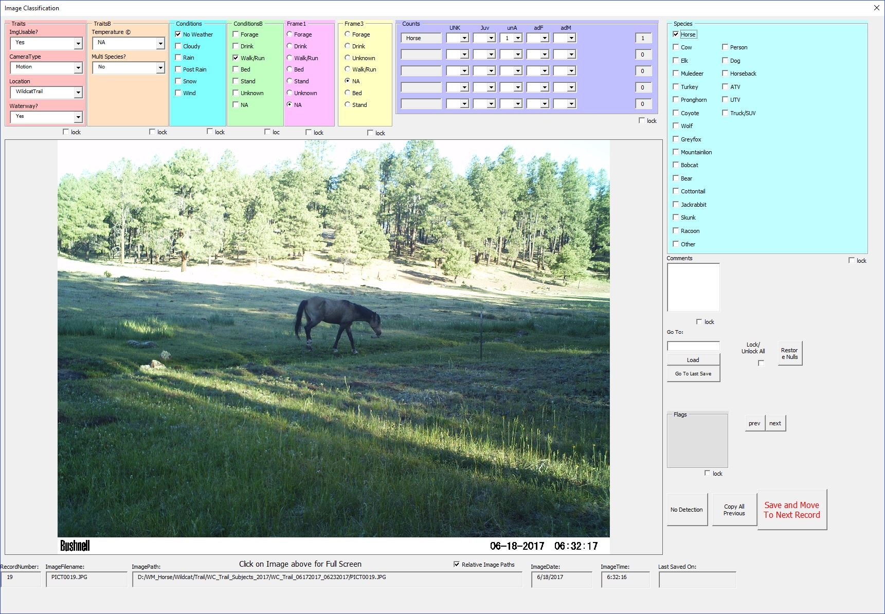

The below screenshot has two red lines drawn onto the image to roughly indicate the +/- 2m strip of land along the *Waterway*.

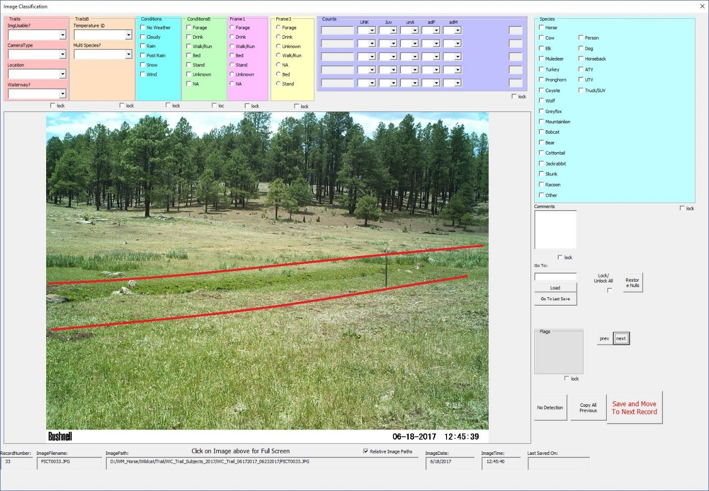

>If animals are within this strip, then you should select "Yes" in the *Waterway* dropdown box within the red "Traits" box.
> 
>If animals are not within this strip, then you should select "No" in the *Waterway* dropdown box within the red "Traits" box.
> 
>Select "NA" in the *Waterway* dropdown box only if there are no animals in the photo.

31. The next set of attributes to score are in the light orange "TraitsB" box (see screenshot below) which has two dropdown boxes that require selections by the person scoring the photo.

The first dropdown box in light-orange "TraitsB" box is the *Temperature* attribute. We set this value to NA as the only option. 

The second dropdown box in light-orange "TraitsB" box is the *Multi Species* attribute which asks if there are multiple species visible in the photo.

>If the photo only has one species visible (such as the deer in the below screenshot), then select "No" in the *Multi Species* dropdown box.
>
>If the photo has more than one species visible (e.g., cows and horses, elk/horses/cows), then select "Yes" in the *Multi Species* dropdown box.
>
>If the photo does not have any species visible in the photo,  then select "NA" in the *Multi Species* dropdown box.


32. The next set of attributes to score are in the teal "Conditions" box (see below screenshot). The teal "Conditions" box is a checkbox format which allows the observer to select multiple attributes if they apply to the photo. The teal "Conditions" box ask you what weather is observed in the photo and allow you to select one or more of the following attributes:

#task check if these weather conditions are still in the macro #updateprotocol

>Select "No Weather" if the photo is sunny or otherwise no observable weather is visible in the photo.
>
>Select "Cloudy" if the photo is overcast.
>
>Select "Rain" if rain is visible in the photo.
>
>Select "Snow" if snow is visible falling to the ground in the photo or if snow is visible on the ground in the photo.
>
>Select "Wind" if dust devils or other indicators of strong winds are visible in the photo, such as blowing tree branches or leaves. Do not select "Wind" if you think its just a gentle breeze.


33. The next attribute to score is the light green "ConditionsB" box (see below screenshot). The light green "ConditionsB" is also a checkbox format allowing the person scoring the photo to select one or more attributes if they apply to the photo. 

The light green "ConditionsB" box asks: what are the behaviors of each individual for the primary species. **Primary species** is defined as the *species that has \>=50% of animals visible in photo* in the case of Multi Species photos.

>Select "Forage" if one or more individuals of the primary species have their head to the ground and perceived to be consuming grass (or other plants).
>
>Select "Drink" if one or more individuals of the primary species have their head in the water and perceived to be drinking from the water.
>
>Select "Walk/Run" if the one or more individuals of the primary species are perceived to be walking. A good indicator of walking or running is when an individual's legs are not even with each other (such as when you take a stride while walking).
>
>Select "Bed" if one or more individuals of the primary species are bedded down (when an animals lies on the ground, usually with it's legs tucked under its body if it's a quadruped).
>
>Select "Stand" if one ore more individuals of the primary species are standing. A good indicator of standing is when an individual's legs are together and on the ground.
>
>Select "Unknown" if the behavior of one or more individuals of the primary species cannot be observed in the photo, such as when an individual's head is not visible in the photo.
>
>Select "NA" on if no animals are visible in the photo.

In the screenshot below there are two mule deer, each individual is displaying different behavior so this photo was scored as two behaviors in the light green "ConditionsB" box. The deer on the left has its head about parallel with its body and looks like it is walking. The deer on the right has its head down towards to ground and looks like it is foraging. 

>[!Note]
>A single individual can display more than one behavior, such as standing and foraging. You can make multiple selections for the same individual.

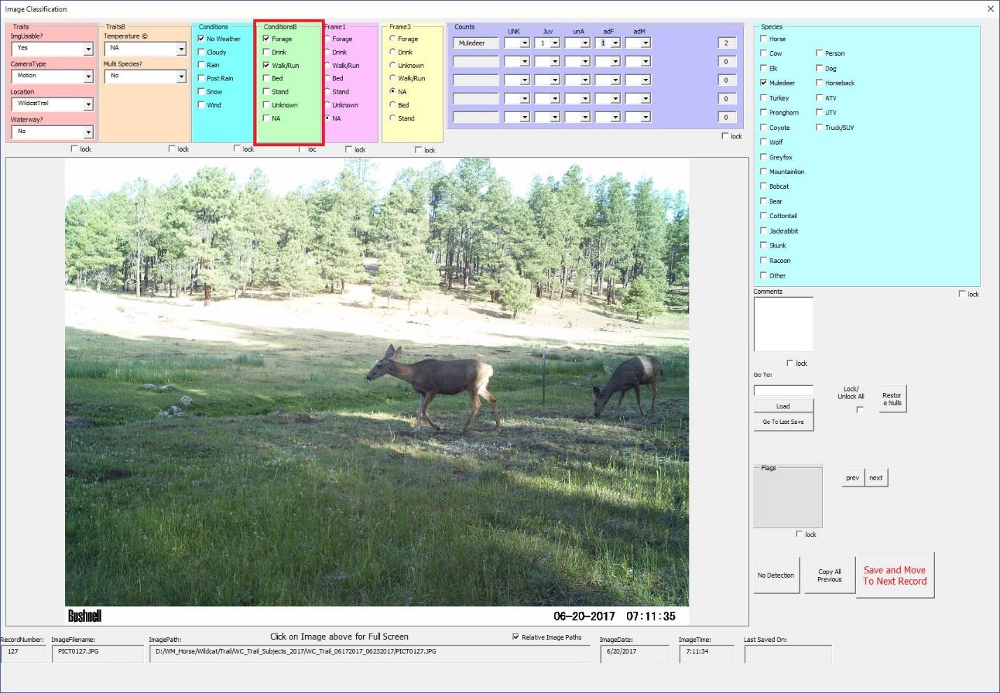

#task change the single selection box to in the “Frame1” box to a multi-selection Box #updatemacro 

34. The next attribute to score is the pink "Frame1" box (see screenshot below). The "Frame1" box is a single selection box that lets the person scoring the photo select only one attribute. This may be changed in future iterations of the Photo Scoring Spreadsheet.

The pink "Frame1" box asks: what is most frequently observed behavior for all individuals visible of the secondary species. The selectable behaviors are the same as in Step 33.

**Secondary species** is defined as the *species that has \<50% of all animals visible in photo* in the case of Multi Species photos.

Example: This situation may arise when there are many cows in the photo and a few horses. In this example, the cow is the primary species and all of the behaviors visible for cows should be selected in the light green "ConditionsB" box. The horses in this example are considered the secondary species. The most frequently observed behavior for all of the horses visible in the photo should be selected in the light pink "Frame1" box.

#task find a photo with multiple species where the area mostly cows and a few horses #updateprotocol 

35. The next attribute to score is the yellow "Frame3" box (see below screenshot). Similar to the light pink "Frame1" box, the yellow "Frame3" box is a single selection attribute.

#task change the order of the selectable behaviors in the “Frame3” box to be in the same order as the other boxes #updateprotocol 

The yellow "Frame3" box asks: What is the most frequently observed behavior for all individuals visible of the tertiary species. The selectable behaviors are the same as in Step 33, however they are in a different order. 

The **tertiary species** is defined as the *species that has the fewest individuals visible in the photo* in the case of Multi Species photos.

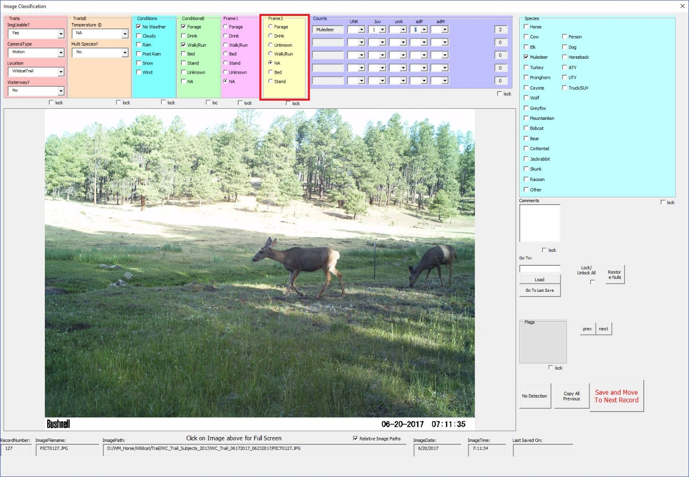

36. Before we score the purple "Counts" box, we must first make one or more selections for light blue "Species" checkbox. The purple "Counts" box is only enabled when selections are made in the light blue "Species" checkbox (see screenshot below).

> Select each box in the light blue "Species" box for each species visible in the photo.

>[!Tip] 
>Identifying species can be tricky sometimes if the photo is dark or blurry, or if only a body part of the animal is visible in the photo. If you are unsure which species is in a photo, flag the photo for further review (see Best Practices). This functionally will be incorporated into future iterations of the Photo Scoring Form.

#task include an option in the next iteration of the macro to flag a photo for review for example if the image might be a coyote or gray fox, but it’s hard to tell #updatemacro

>[!Note]
>Coyotes are sometimes hard to distinguish from gray foxes or wolves, especially at night. If you are unsure, flag the photo.
>
>The "Other" selection can be used for species not listed in the "Species" checkbox.

Some knowledge of common animal species is required for quality photo scoring.

In the below screenshot, only mule deer are visible, therefore only the "Muledeer" selection was checked in the light blue "Species" checkbox.


37. After we make one or more selections in the light blue "Species" box, the species we selected will appear in the purple "Counts" box (see screenshot below). The "Counts" box asks: how many individuals for each species selected are visible in the photo, and what are their age and sex classes (if age and sex class can be determined visually). Some knowledge of common species is required for quality photo scoring.

#task where is the example photo for the “Counts” box #updateprotocol 

>The "UNK" (unknown) dropdown box should be selected when age class and sex cannot be reliably determined, but the number of individuals of that species can be determined. Selectable values range from 0 to 20.
>
>The "Juv" (juvenile) dropdown box should be selected when you can reliably determine age class for a number of individuals of that species. Selectable values range from 0 to 20. Indicators of species age include pots on a deer fawn, a foal (juvenile horse) stands next to an adult horse and the foal is clearly much smaller than an adult horse.
>
>The "unA" (unknown adult) dropdown box should be selected when you can reliably determine that a number of individuals are adults but cannot reliably determine if those adult animals are male or female. Selectable values range from 0 to 20. Horses can be difficult if you cannot see sex organs in the photo, therefore it is safer to select a number of "unA" than to guess at the number of adult males or females
>
> The "adF" (adult female) dropdown box should be selected when you can reliably determine that a number of individuals are adult females of that species. Selectable values range from 0 to 20.
>
>The "adM" (adult male) dropdown box should be selected when you can reliably determine that a number of individuals are adult males of that species. Selectable values range from 0 to 20. Indicators of adult males include during the summer and fall, adult male deer and elk have antlers or 'horns'

Repeat this process of counting number of individuals for each species and dividing them into age and sex classes for all species visible in the photo (in the case of a Multi Species photo).

In the below screenshot, there is one adult female deer (doe) at the center of photo and one juvenile deer (fawn) on the right side of the photo. At this time of the year (June 20) you would expect an adult male deer (buck) to have antlers, even if they are still in velvet. You can look at the size difference between the adult doe and fawn to determine age class. Also, the head to ear proportions on juvenile animals are usually different than adult animals. After scoring many photos, you will become better at correctly classifying age and sex.


38. You can add comments to a photo using the "Comments" box (see screenshot below). A useful comment might be "Is this a fox or a coyote?" or "Person in this photo was checking the camera". Supervisors will review these comments and decide on what to do with photos with reasonable uncertainty.

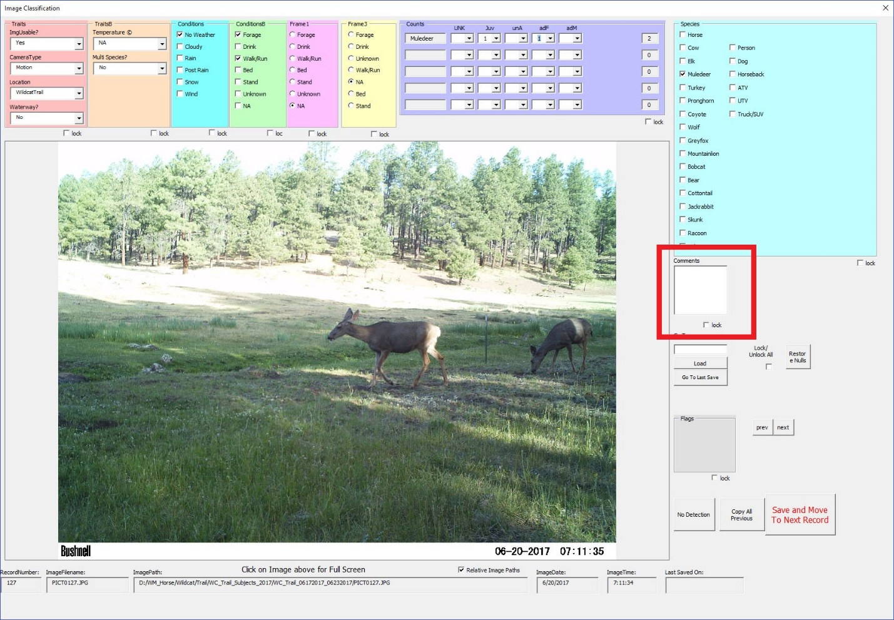

39. The "Restore Nulls" box (see screenshot below) will reset all the attributes to their default settings and *erase* all the attributes you selected. You can use "Restore Nulls" to quickly reset the selections made on a photo.

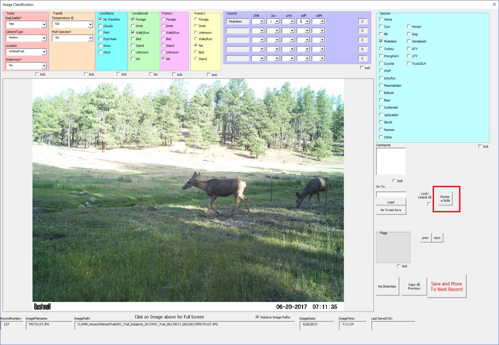

40. The "lock" check boxes found at the bottom of each box (see screenshot below) remembers the values you selected for each box when you go to the next picture. The "lock" feature is a valuable time-saving feature that you can use to have the form remember commonly selected attributes.

Example: All of the photos you are scoring are from the Wildcat Trail camera, which is a motion activated camera. By selecting the "lock" checkbox underneath the red "Traits" box, the form will remember you selected those attributes when you go to the next photo.

>The "Lock/Unlock All" checkbox (see in the below screenshot with a star next to it) can unlock or lock all the boxes without having to manually click each checkbox.


41. If you do not detect an animal in the photo click the "No Detection" button to autofill the purple "Counts" table with zeros. You must click "No Detection" button before the Photo Scoring Form will allow you to go to the next photo.

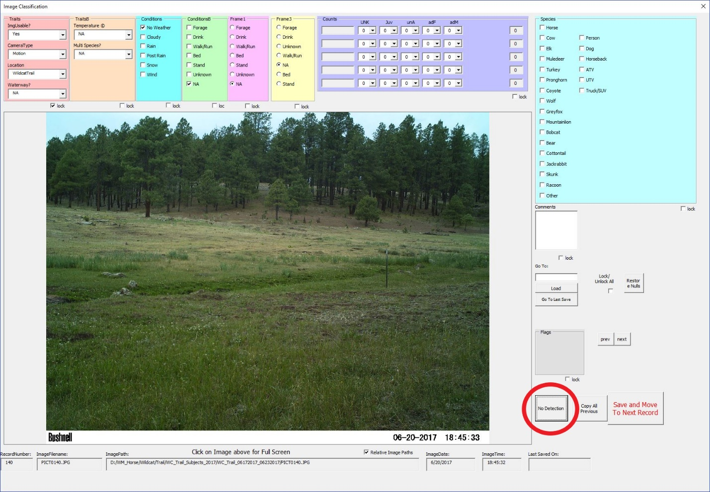

>[!Important]
>42. **Important**: The last thing you *must* do before scoring the next photo is to click the red "Save and Move To Next Record" button. This button will save all of the selections you made in all of the colored boxes. If you do not hit this button, all of the selections you made for that photo will be lost!


43. After you have saved and moved to the next photo, you may find that many of the attributes you selected have not changed from one photo to the next. You can use the "Copy all Previous" button (see screenshot below) to quickly copy all of the selections you made on the previous photo to your current photo. Be sure to change attribute selections if something *does* change between photos.

>In the next photo after the doe and fawn, only a single deer is visible and you can’t reliably determine if it's an adult or juvenile. You can use "Copy all Previous" to copy the attribute selections you made on the last photo and then just change the values in the "Counts" box to “1 UKN”.

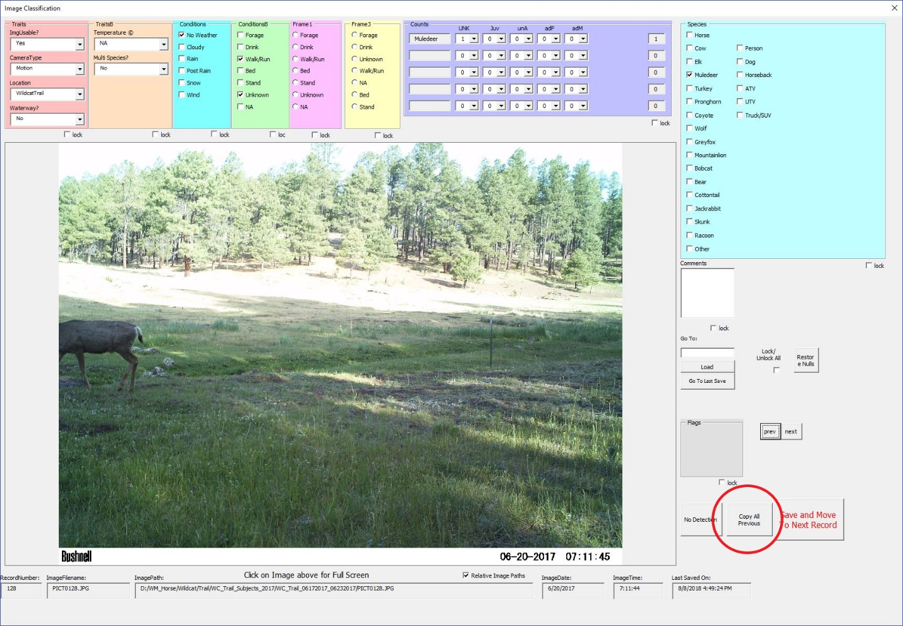

44. Finally, repeat the photo scoring process for all of the photos in your photo assignment.

## Appendix

### Table of Camera Trap Names

| **Camera Name**     | **Sitecode** | **Folder Naming Convention**<sup>1</sup> |
| ----------------------- | ------------ | ---------------------------------------- |
| Fifty-One                | A51          | A51_MMDDYYYY_MMDDDYYYY                   |
| Agua Chiquita Barbed    | ACB          | ACB_MMDDYYYY_MMDDYYYY                    |
| Agua Chiquita Electric  | ACE          | ACE_MMDDYYYY_MMDDYYYY                    |
| Agua Chiquita Exclosure | ACX          | ACX_MMDDYYYY_MMDDYYYY                    |
| Agua Chiquita Homestead | ACH          | ACH_MMDDYYYY_MMDDYYYY                    |
| Agua Chiquita Upland    | ACU          | ACU_MMDDYYYY_MMDDYYYY                    |
| Bear Timelaspe          | BRL          | BRL_MMDDYYYY_MMDDYYYY                    |
| Bear Trail              | BRT          | BRT_MMDDYYYY_MMDDYYYY                    |
| Bigfield                | BFD          | BFD_MMDDYYYY_MMDDYYYY                    |
| Black Canyon Dam        | BKD          | BKD_MMDDYYYY_MMDDYYYY                    |
| Black Canyon North      | BKN          | BKN_MMDDYYYY_MMDDYYYY                    |
| Black Canyon South      | BKS          | BKS_MMDDYYYY_MMDDYYYY                    |
| Black Canyon Trail      | BKT          | BKT_MMDDYYYY_MMDDYYYY                    |
| Boggy East              | BGE          | BGE_MMDDYYYY_MMDDYYYY                    |
| Boggy Trail             | BGT          | BGT_MMDDYYYY_MMDDYYYY                    |
| Boggy West              | BGW          | BGW_MMDDYYYY_MMDDYYYY                    |
| Boggy West 5 Min        | BGW_5min     | BGW_5min_MMDDYYYY_MMDDYYYY               |
| Highway                 | HWY          | HWY_MMDDYYYY_MMDDYYYY                    |
| James Canyon            | JCY          | JCY_MMDDYYYY_MMDDYYYY                    |
| Rip Penasco Riparian    | RPR          | RPR_MMDDYYYY_MMDDYYYY                    |
| Upper Wills Canyon      | UWL          | UWL_MMDDYYYY_MMDDYYYY                    |
| Wildcat Exclosure       | WCX          | WCX_MMDDYYYY_MMDDYYYY                    |
| Wildcat North           | WCN          | WCN_MMDDYYYY_MMDDYYYY                    |
| Wildcat South           | WCS          | WCS_MMDDYYYY_MMDDYYYY                    |
| Wildcat South 5 Min     | WCS_5min     | WCS_5min_MMDDYYYY_MMDDYYYY               |
| Wildcat Trail           | WCT          | WCT_MMDDYYYY_MMDDYYYY                    |
| Wills Canyon Riparian   | WLR          | WLR_MMDDYYYY_MMDDYYYY                    |
| Wills Canyon Upland     | WLU          | WLU_MMDDYYYY_MMDDYYYY                    |
|                         |              |                                          |

<sup>1</sup> this naming convention refers to the date of the first photo on the SD card in the 100EK113 folder, and the date of the last photo in last 1xxEK113 sub-folder on the SD card. If there is date error, use the corrected date for this naming convention, but be sure to make note of the date corrections in the camera trap metadata standard XML file.

### Camera Trap Test Photo Metadata Sheet

[Camera Trap Metadata and Checklist Data Sheet v1.4](../datasheets/Camera%20Trap%20Metadata%20and%20Checklist%20Data%20Sheet%20v1.4.pdf)

### Camera Trap Maintenance Visit Metadata Sheet

[Camera Trap Test Photo Data Sheet v1.2](../datasheets/Camera%20Trap%20Test%20Photo%20Data%20Sheet%20v1.2.pdf)

### Sorting and Scoring Best Practices

***Difficult to Identify Subjects***

Sometimes a photo contains a subject that is difficult to identify, such as barely visible eyes of an animal reflect the infrared camera flash, a dirty lens, or only a body part of an animal is in the photo. During the photo sorting phase, still copy the photo with the difficult to identify subject into the folder "Subjects" folder (see Step 7 above). It's safer to include the photo in the "Subjects" folder than to not include the photo. Researchers can examine the photo closely during the Photo Scoring phase to determine if the photo contains a subject.

***Flagging Photos for Further Review***

If you are unsure what species is in the photo, write a comment in the “Comments” box for the photo so another researcher or supervisor can review the photo and come to a conclusion to exclude the photo from analysis if the subject is too obscured for a reliable identification, or to include the photo in analysis if the researchers are confident with a reasonable degree of certainty they can identify the subject in a photo.

Take-Away Message: If you are unsure of the subject of a photo, err on the safe side and comment it for further review.

***File Management***

It is safer to use copy/paste than by clicking and dragging (i.e. moving) photos from one place to another. When you move photos, they are no longer in their original location or sometimes not in their original order. Mistakes happen, especially during repetitive tasks like photo sorting. If you always have the original files stored somewhere safe, then you can always refer back to those original files if something goes wrong.
