# Photo Tagging and Sorting Using IrFanView

1.  Navigate to <https://www.irfanview.com> with your web browser (e.g.,
    Google Chrome) and click on the "Download" tab (see screenshot
    below). 

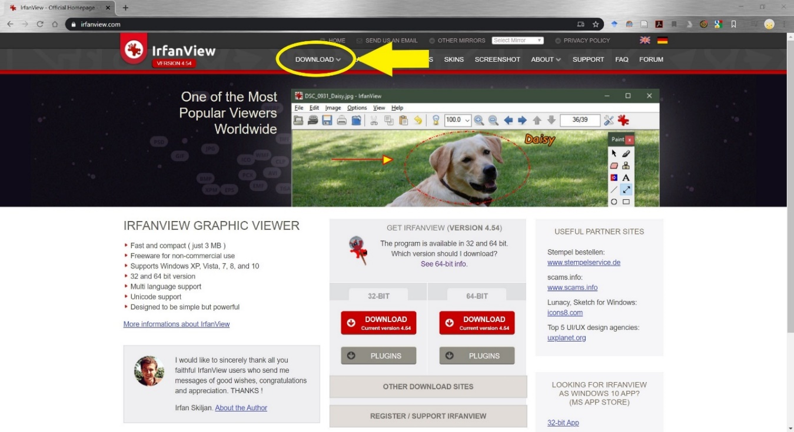

2.  Download and install the 64-bit version of IrFanView to your system. Select the correct version for your operating system (e.g., MacOS, Windows) (see screenshot below).

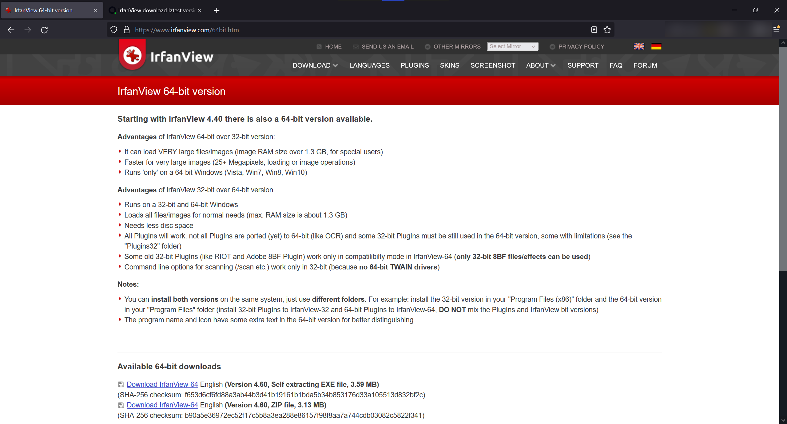

3.  The download tab will re-direct you to another web page to download IrFanView. An automatic download will start. If an automatic download does not start, select the correct 64-bit installer for your operating system (see screenshot below).

4.  You will be prompted to install the software on your machine. Click "Allow Changes" to proceed with the software installation. 
> [!Note]
> You will need administrator access to install this application.

5. Proceed with the software installation using the IrFanView installation wizard (see screenshot below).

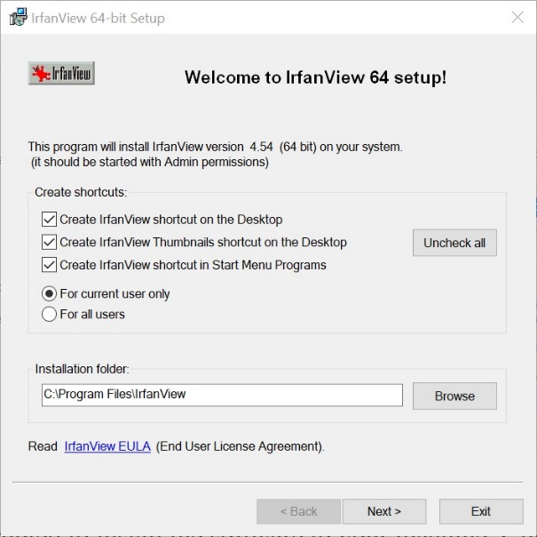

# Setting IrFanView as Your Default Image View (Optional)

> [!Optional]
> 6.  You can optionally set IrFanView as your default image viewer. This will cause your system to automatically launch IrFanView when you double-click on a photo.

6a. Navigate to the "Windows Settings" on your machine and then click on "Apps" (see screenshot below). 

6b. On the "Apps & features" screen, click on the "Default apps" tab
(see screenshot below).

6c. On the "Default apps" screen, select IrFanView as your default
viewer (see screenshot below).

#  Selecting Photo Assignments on Basecamp

7. To select a photo assignment on Basecamp, go the "To-dos" section under the "Camera Studies" project.

There will be multiple groups under each assignment with each group corresponding to a task that needs to be completed for each folder. For example, under the "Sorting Assignments" section, folders under this section need to be sorted (to remove empty photos). We allow students to self-assign photo assignments at the discretion of the project manager. 

8. To self-assign a folder, click to the right of the assignment (e.g., Sort BGW_04182019_05212019 in the screenshot below) and then add your name beside the assignment. In the screenshot below, you can see that Elizabeth E. has their name beside the assignment "Sort WCS_07032019_09182019 \[check for upload\]".

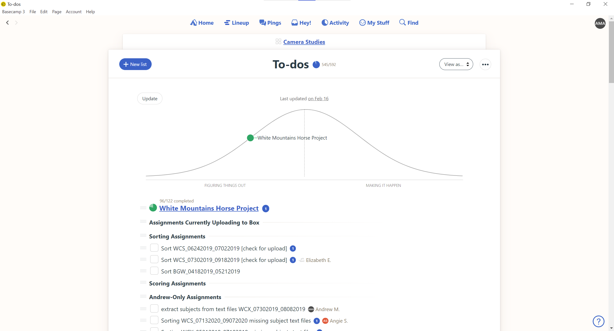

9. Generally, we ask that assignments be completed with 2 weeks are they are self-assigned. Andrew or Brandon will contact you to check on the progress of each assignment if you go past that 2-week window. If you fail to turn in an assignment within a month, your name will be removed from that assignment and the assignment will be given to someone else.

# Sorting Photos Using IrFanView

10. Open the sub-folder of photos (e.g., 100EK113) you are going to sort in Windows Explorer (see screenshot below).

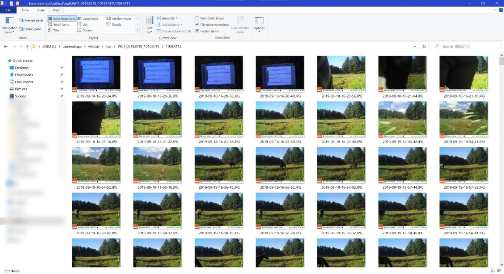

11. Double-click on the first photo in the folder. This should automatically launch IrFanView (if you set it as your default image viewer in step 6). OR you can right click on the first image, choose "Open with" and then choose "IrFanView 64 bit") (see screenshot below).

12. IrFanView automatically recognizes all the images in a folder, so you can flip through images in the folder with the arrow keys on your keyboard.

It is highly recommended that enter full-screen mode when you sort photos so you can see small changes in each image. You can enter full-screen mode by double-clicking on an image when it is already open in IrFanView, or by hitting the enter key on your keyboard.

Additionally, it is also recommended that you setup "Full Screen Only-Show Text" which can be configured to display the pathway to each image (i.e., the location of each image on your computer) and how many images are left to sort in folder (and other settings you might find useful).

To do this, first click the "Preferences" tool icon on the IrFanView toolbar (see screenshot below).

12. The "Preferences" window will open. Click on the "Full Screen \/Slideshow" option on the left-hand side. Then setup your "Full Screen Only" preferences similar to the screenshot below. Text in the bottom-left seems to work well as it doesn't cover up potentially useful areas in each image. (Note: you may have to adjust the font size and color depending on your personal preferences).

13. Now when you open an image in Full-Screen mode, you should see some text in the bottom left-hand side that tells you the location of the image on your machine and how many photos remain in the folder (in the screenshot below: 4/999).

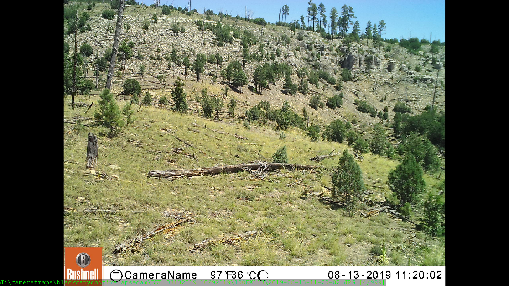

13b. IrFanView allows you to "Tag" images when you flip through them. To tag an image simply hit the "X" key on your keyboard. IrFanView will temporarily tag the image, denoting tagged images with an X alongside the text you setup in the "Full Screen Only" options (see screenshot below).

> [!Important]
> Note: Image tags will disappear if you close IrFanView in the middle of an image folder. It is highly recommended that complete at least 1 sub-folder (e.g., 100EK113) during a photo sorting session.*

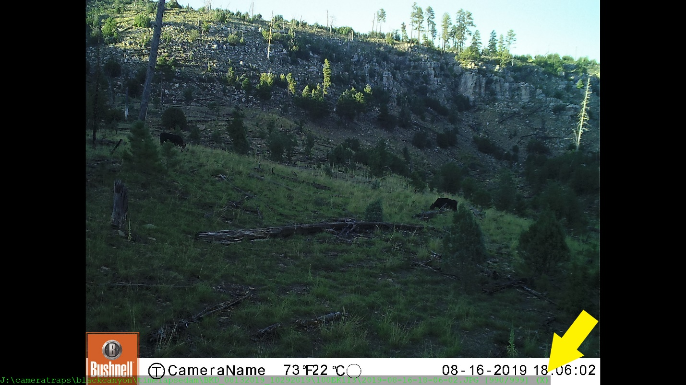

14. **Tag all photos with subjects** (i.e. all of the images with something in it; see the "Wild Horse Camera Trap Sorting and Scoring Protocol.docx" for more definition) in the sub-folder (e.g., 100EK113). You can un-tag a photo by hitting the "Shift + X" keys on your keyboard to remove the temporary tag.

15. When you complete a sub-folder, hit the "Shift" + "Q" keys on your keyboard to open the tagged Thumbnails window.

> [!Important]
> You must open the tagged Thumbnails window before moving to another sub-folder or you will lose your tagged photos.

16. The "Thumbnails" window displays all of the tagged photos. You must first select-all of the photos by clicking the first photo, hold down the "Shift" key, and then select the last photo, or hold down the "Control" key and hit "A" on your keyboard to select all. You screen should resemble the screenshot below.

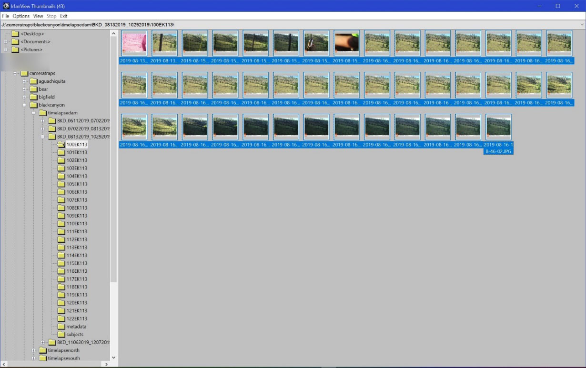

17. Save these tagged photos as a text file by clicking the "File" option in the upper-left side of the window, and then "Save selected file names as TXT".

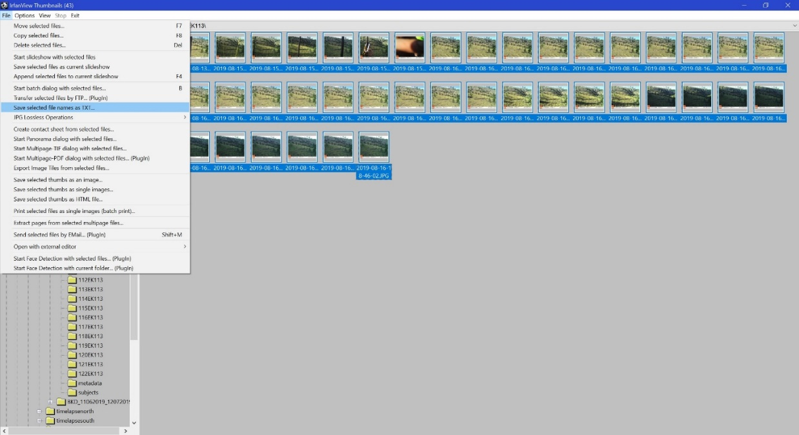

18. Save this text file into the assignment folder (e.g., the assignment folder is BGW_09072020_09242020 in screenshot below). Use the following naming scheme:

BGW_09072020_09242020_100EK113_subjects.txt

Where 
**"BGW"** is the sitecode; 
**"09072020"** is the date of the first photo in the folder;
**"09242020"** is the date of the last photo in the folder;
**"100EK113"** is the name of the sub-folder you sorted; 
**"subjects"** indicates that data in the text file is only photos that contain subjects (e.g., animals, humans, vehicles).

19. Tag all the photos with subjects in each sub-folder, save these tagged photos as a text file in the assignment folder. Do this for all
of the sub-folders (e.g., 100EK113, 101EK113, 102EK113) in the assignment folder (e.g., BGW_09072020_09242020). When finished, the assignment folder should contain only text files (see screenshot below).

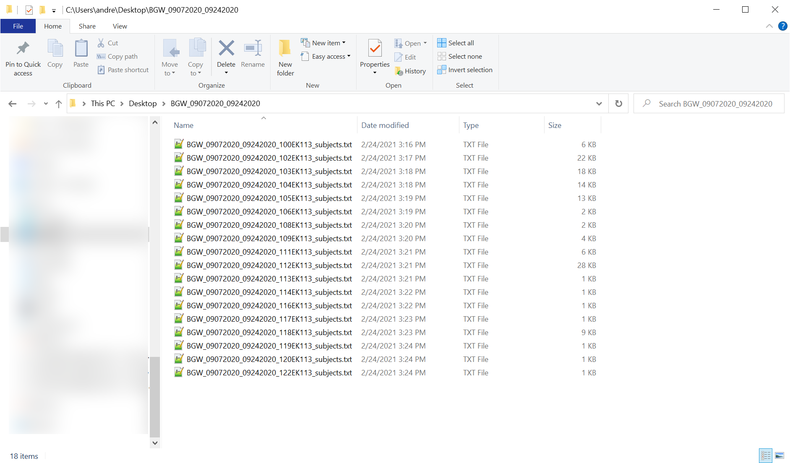

20. If you sort a sub-folder (e.g., 100EK113) that *does not* contain subjects, create an empty text file by right-clicking on the an empty space within the assignment folder, then selecting "New" and then "Text Document". Name this empty text file using the same naming scheme (replacing the name of the assignment and sub-folder to the assignment and subfolder you are working on), except add "no_subjects" to indicate that you sorted through the folder but did not detect any subjects. This is important to document that you did not skip or miss a sub-folder.

BGW_09072020_09242020_100EK113_no_subjects.txt

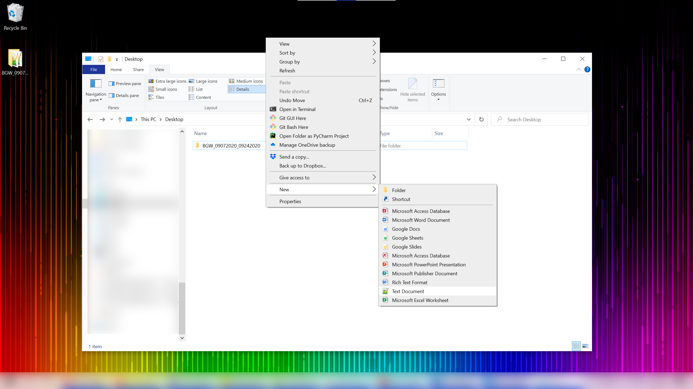

# Uploading Text Files to Basecamp

21. Compress the assignment folder (containing all of the text files) using the built-in Windows compression utility. Right click on the folder, select "Send To", and then "Compressed (zipped) folder. This will help keep all of the text files together as a single file (instead of as folder with many files). 

22. The final step in sorting photos is to upload the subject text files to Basecamp. Under the Camera Studies > To-dos section, find the folder that you sorted (e.g., BKS_08132019_09132019) and upload the compressed folder (.zip file) under that assignment (see screenshot below).

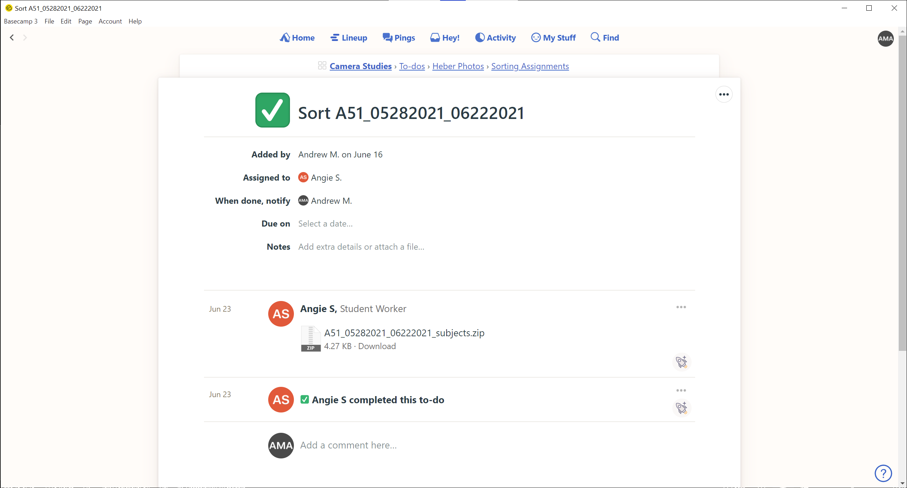
