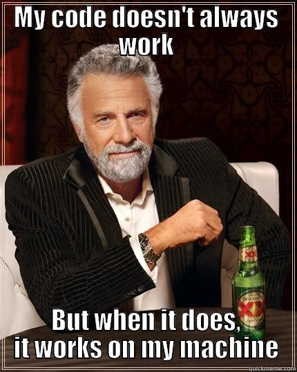

# How to Share Analysis with Docker Containers
Created: 2022-09-08 10:08:49

A common problem when trying to reproduce analysis are the intervening changes in the underlying software dependencies that run the analysis code. Changes in software dependencies such as your operating system (e.g., Windows 10, MacOS) and the R packages themselves used in your analysis (e.g., dplyr, lubridate) can cause analyses to fail or produce different results. Docker containers gives scientists the ability to share their exact analysis code and software dependencies with other scientists making research and collaboration more reproducible, potentially many years later (more on that later).


Credit: http://www.quickmeme.com/p/3vuukg/page/5

To get started, you first need to install the software to run the Docker containers, for many scientists, this is Docker Desktop [(Download Link)](https://www.docker.com/products/docker-desktop/) Docker Desktop runs containers using your local computer’s resources (memory, storage, and processor). Docker can also be run on servers for larger analysis and collaboration. Projects such as [Cyverse](https://cyverse.org/) run Docker containers (called “Apps” on Cyverse) and as well as host data on their file system.

To run Docker containers locally, for Windows 10 or 11 users, you will first need to install Windows Subsystem for Linux (WSL). The WSL runs a Linux kernel inside of a virtual machine on your local computer. Docker requires the WSL to run on Windows computers. Follow the [Installation Instructions](https://docs.microsoft.com/en-us/windows/wsl/install). I would recommend installing Ubuntu 18.04 or 20.04 as your Linux distribution. 

Run this in a PowerShell (Administrator) terminal to install Ubuntu-18.04.
```PowerShell
wsl --install -d Ubuntu-18.04
```

Or

Run this in a PowerShell (Administrator) terminal to install Ubuntu-20.04
```PowerShell
wsl --install -d Ubuntu-20.04
```

Your PowerShell terminal should look like this:


After you’ve installed WSL and Docker Desktop, you can run Docker containers on your local machine. To run a container for this project, you can run this PowerShell script which has the [[scripts/utilities/docker-run-commands.ps1]] necessary commands to launch the Docker container. 

## Clone the Repo with the Analysis Code

You will need to edit the location of the file mounts inside of that PowerShell script. Change the location of `C:/Users/andre/Dropbox/Dev/grazing-interaction` to the location of the cloned repo on your computer (i.e. the folder containing the analysis code).

This is code from [[scripts/utilities/docker-run-commands.ps1]]

```PowerShell
docker run -d -e DISABLE_AUTH=true -e ROOT=TRUE --rm -p 127.0.0.1:8787:8787 `
-v C:/Users/andre/Dropbox/Dev/grazing-interaction:/home/rstudio/grazing-interaction `
-v G:/cameratraps:/home/rstudio/cameratraps `
-v G:/cameratraps2:/home/rstudio/cameratraps2 `
-v C:/Users/andre/temp:/home/rstudio/temp `
amantaya/rocker-verse:4.0.5
```

## Running the Container

## Tags
#🚧 #tutorial #docker #wsl 

## References
1. 